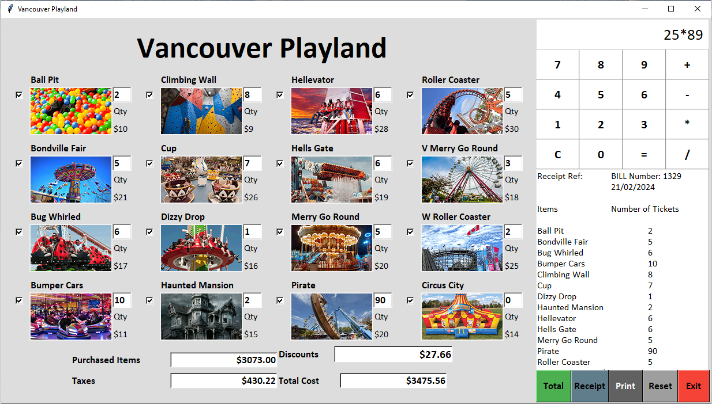

**Playland Application**

This application serves as a user-friendly interface for purchasing tickets to Vancouver Playland. Users can easily select attractions, calculate costs, generate receipts, and access a range of other useful functionalities.

**Requirements:**
- Python 3.11.5
- Tkinter (version 8.6)

**Features:**

1. **Attraction Selection:** Users can select from a variety of attractions available in the Playland.
   
2. **Cost Calculation:** The application calculates the total cost of selected attractions, including taxes and discounts.

3. **Receipt Generation:** Users can generate detailed receipts containing information about purchased items, discounts, taxes, and total cost.

4. **Calculator Integration:** The application includes a calculator module to facilitate calculations within the application.

**Modules:**

1. **Main Application (`PlaylandApp`):** Manages the GUI and functionalities of the Playland application.

2. **Calculator (`calculator`):** A separate module providing calculator functionalities to the main application.

**Unit Test:**

The directory includes a unit test designed to test the functionalities of the application. This test ensures the reliability and accuracy of the application's features.

**Usage:**

1. Run the `PlaylandApp` module to start the application.
   
2. Select attractions and specify quantities.
   
3. Use the calculator functionalities integrated into the application for calculations.
   
4. Generate receipts to view detailed information about the transactions.
   
5. Utilize the provided unit test to verify the correctness of the application's functionalities.

**Images:**

**Note:** Ensure that all necessary dependencies are installed and the application directory structure is maintained for proper functionality.
